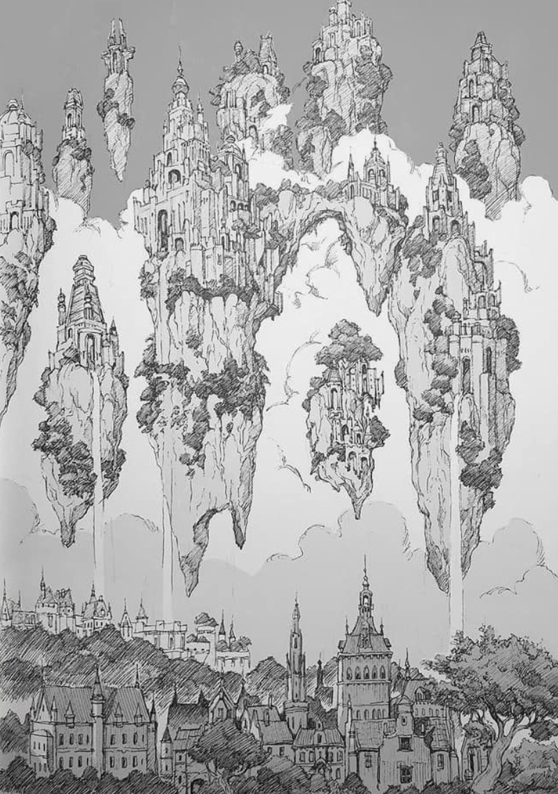
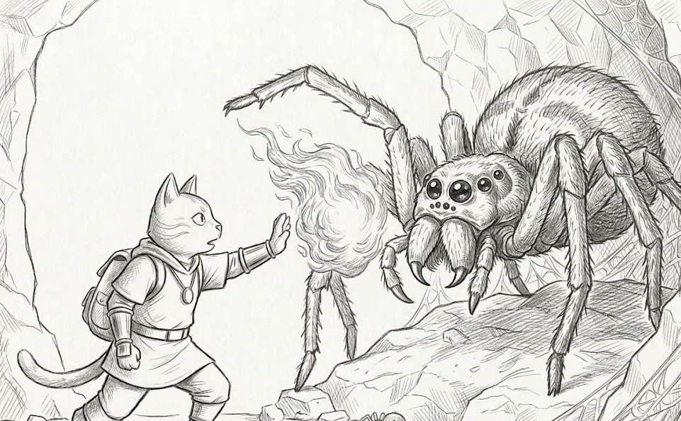

<!DOCTYPE html>
<html lang="en">
<head>
    <meta charset="UTF-8">
    <meta name="viewport" content="width=device-width, initial-scale=1.0">
    <title>Quieres jugar?</title>
    <link rel="stylesheet" href="styles.css">
</head>
<body>
    <header>
                <h1>Gat_Arc</h1>
                <h2>Bienvenido, jugador, a partir de ahora te vas embarcar en una aventura de animales, magia y acción!</h2>                           
    </header>
    <section id="about">
        

            <h1>Descubre un mundo magico lleno de caos</h1>
                

                    <h3>Explora</h3>
                    
Un amplio mapa de mundo abierto con 4 biomas

                    
                

                

                    <h3>Pelea</h3>
                    
Enfrentate a enemigos y jefes poderosos

                    
                

                

                    <h3>Cumple tu mision</h3>
                    
Completa misiones primarias y secundarias

                    
                
            
        

    </section>
    <section id="historia">
            <h1>Algo de historia</h1>
            

                En este mundo serás un gato que trabaja para una organizacion que tiene la mision de acabar con la guera, 
                esta guerra empieza por culpa de una flor mágica con un poder increíble, La ambición de las criaturas por replicar su 
                poder ha llevado todo a ser un completo caos.
            
 
             
    </section>
    <section id="demo">
        <h1>Demo</h1>
        
    </section>
    <section id="nosotros">
        <h1>¿Quienes somos?</h1>
        

            

                <h3>Gato</h3>
            

            

                <h3>Iguana</h3>
            

            

                <h3>Shark</h3>
            

            

                <h3>Jirafa</h3>
            

            

                <h3>Hipo</h3>
            

            

                <h3>Rino</h3>
            

        

    </section>
    <footer>
        <h3>Los desarrolladores nos disculpamos por el poco progreso que hay de el juego</h3>
    </footer>
</body>
</html>
